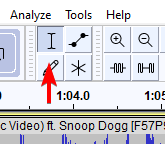
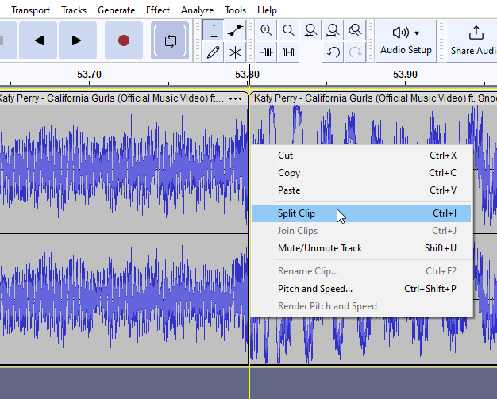
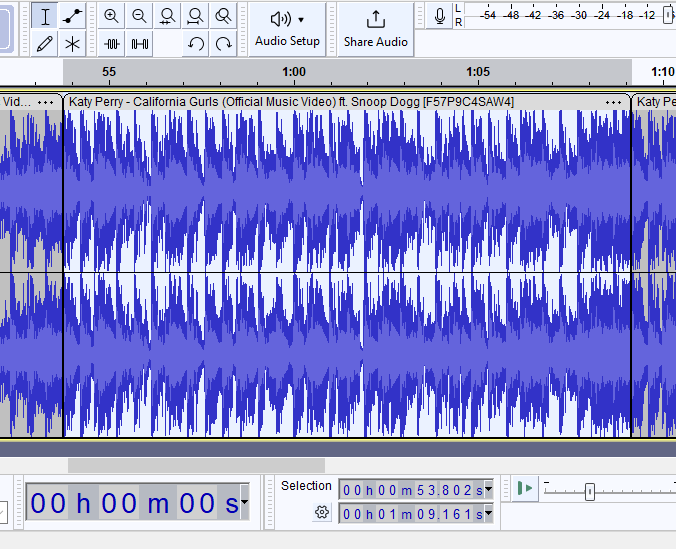

# Creating audio loops with Audacity

1. Source an audiofile. You can use something like `yt-dlp` for this.

2. Make sure the select tool is being used.

   

3. Find a poing where you loop begins.

4. Split the audio clip at this point.

   

5. Repeat step 3 and 4 for the end point of the loop.

6. If you double click that selection and click play, you can preview the loop. The selection will show the time stamps of the begin and end point of the loop in the selection box.

   

7. To only get this looping part. You can cut selection, select all, delete and finally paste: `Ctrl` `X` > `Ctrl` `A` > `Delete` > `Ctrl` `V`.